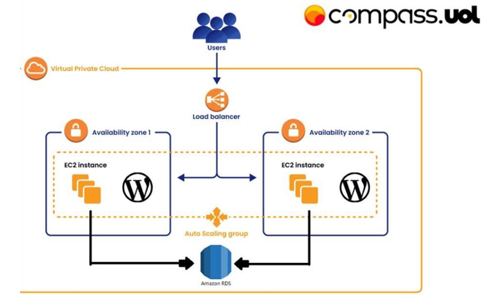
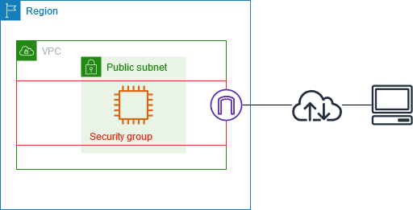
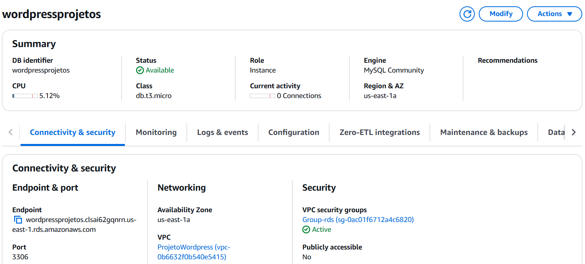
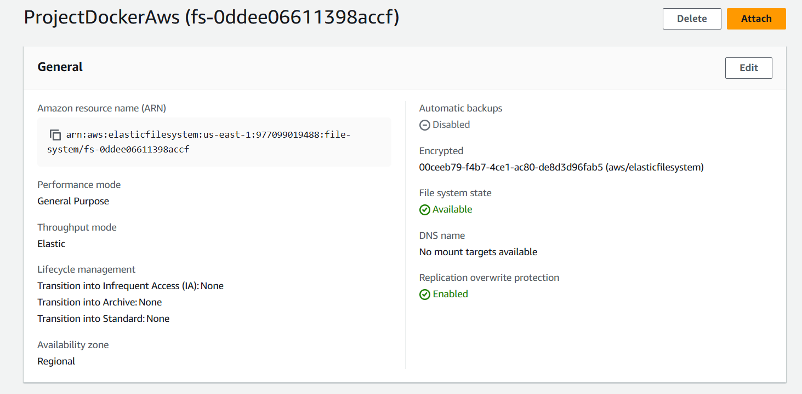
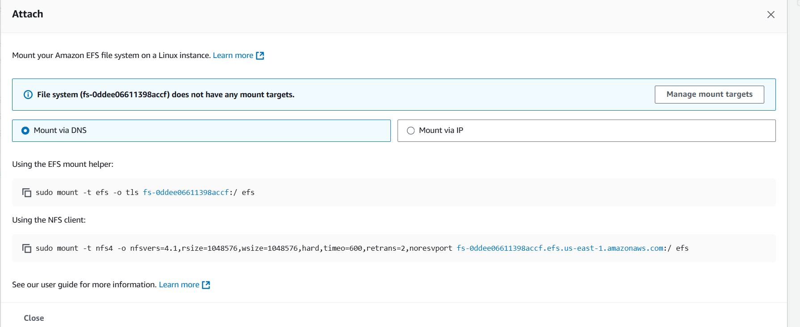
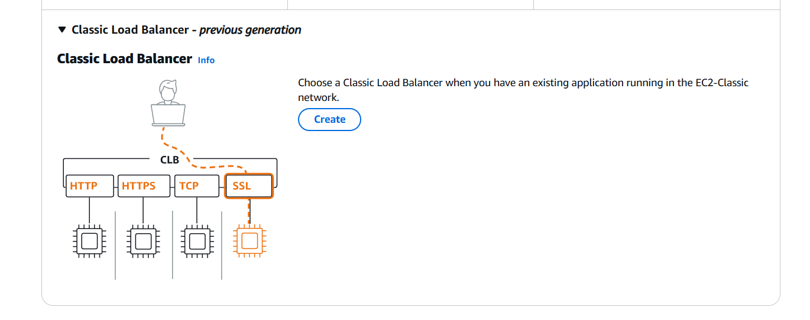
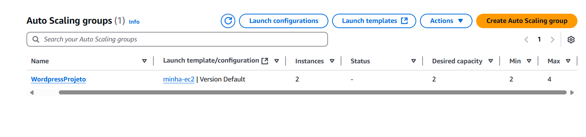
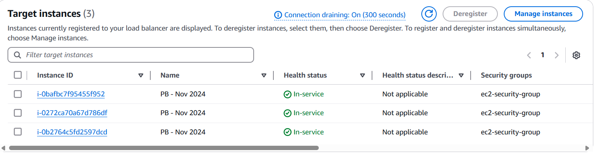
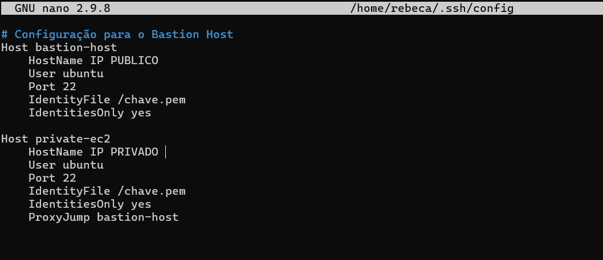

# Implantação de WordPress com Docker na AWS

Este projeto tem como objetivo permitir que a gente aprenda os conceitos que estamos estudando na teoria, aplicando-os na prática ao implementar a infraestrutura e a configuração de uma aplicação. A proposta é integrar tudo o que estamos aprendendo sobre aspectos de Docker, AWS e outras tecnologias, trabalhando em containers e em como funciona a AWS.

## Objetivos do Projeto

- **Automação de Tarefas** 🛠️: Utilização de scripts para automatizar a configuração e deployment da aplicação.
- **Banco de Dados RDS** 🗄️: Configuração do **RDS** (Relational Database Service) para gerenciamento do banco de dados.
- **Armazenamento de Arquivos Estáticos** 📂: Utilização do **EFS** (Elastic File System) para armazenamento e acesso a arquivos compartilhados.
- **Balanceamento de Carga** ⚖️: Implementação de um **Load Balancer** para distribuir o tráfego entre as instâncias.
- **Escalabilidade Automática** 📈: Implementação de **Auto Scaling Group** para escalar automaticamente o número de instâncias EC2 conforme a demanda.
demanda.


## Estrutura do Projeto

Abaixo está a estrutura do projeto a partir de uma imagem:




## Índice das Tarefas 

1. **Teste local com script**
2. **Criação da VPC e Configuração de Rede**
3. **Configuração de Grupos de Segurança**
4. **Criação do RDS (Banco de Dados)**
5. **Configuração do EFS (Elastic File System)**
6. **Configuração da Instância EC2**
7. **Configuração do Load Balancer (AWS)**
8. **Auto Scaling Group**
9. **Bônus: Configuração do Bastion Host**

---

# 1. Teste local com script #

Antes de iniciar a implementação completa na AWS, realizei testes na minha máquina local utilizando o WSL com o Ubuntu instalado, a fim de entender como o script user_data.sh funcionaria.

Criei um arquivo chamado testelocal.sh, onde inseri os comandos necessários para a instalação do Docker, além de configurar um ambiente com o WordPress e o MariaDB utilizando Docker Compose. O script automatiza a instalação do Docker, a criação de volumes persistentes e a configuração dos containers para o WordPress e o MariaDB. Esse teste local permitiu simular a configuração completa antes de aplicá-la na AWS, garantindo que o ambiente estivesse pronto para a execução.

No terminal concedi a permissão ao arquivo com 
```bash
chmod +x testelocal.sh
```
em seguida para rodar o script localmente:
```bash
./user_data.sh
```

O script utilizado encontra-se abaixo, mas, para ser utilizado no user_data.sh, algumas modificações foram feitas ao decorrer do processo, conforme necessário.

[O script usado para teste encontra-se aqui.](scripts/testelocal.sh).

Aqui podemos ver rodando localmente :


**Após os testes locais, iniciei a implementação do projeto na AWS.


# 2. Criação da VPC e Configuração de Rede #

## **Criação de uma VPC Personalizada para o Projeto** ##

Como a arquitetura solicitada exige a criação de sub-redes públicas e privadas, é mais eficiente configurar uma VPC personalizada, mesmo que a AWS já forneça uma VPC padrão com configurações predefinidas. Para criação da  VPC é um processo simples; basta seguir os passos abaixo:

---

## **Passo 1: Criar a VPC**

Acessei o console da AWS e procurei por **VPC** na barra de pesquisa.  
Cliquei em **Create VPC** e preenchi os seguintes campos:  
- **Name Tag**: ProjetoWordpress  
- **IPv4 CIDR block**: Defini o intervalo de IPs como 10.0.0.0/16  

---

## **Passo 2: Configuração de Sub-redes**

### **Sub-redes Públicas**:
Criei duas sub-redes públicas para o tráfego de internet do **Load Balancer** e do **NAT Gateway**.  

### **Sub-redes Privadas**:
Criei duas sub-redes privadas para as instâncias **EC2** e o banco de dados.  

---

## **Passo 3: Configuração de Gateways e Tabelas de Rotas**

### **Criação do Internet Gateway (IGW)**:
Naveguei até **Internet Gateways** e cliquei em **Create Internet Gateway**.  
Nomeei o IGW e o conectei à VPC que havia criado.  

### **Configuração de Rotas para Sub-redes Públicas**:
Criei uma **tabela de rotas pública** e associei-a às sub-redes públicas.  
Adicionei uma rota com o destino **0.0.0.0/0**, apontando para o **Internet Gateway (IGW)**, permitindo que o **Load Balancer** nas sub-redes públicas acessasse a internet.  

### **Criação do NAT Gateway**:
Fui até **NAT Gateways** e criei um NAT Gateway em uma das sub-redes públicas.  
Aloquei um Elastic IP para o NAT Gateway.  

### **Configuração de Rotas para Sub-redes Privadas**:
Criei uma **tabela de rotas privada** e associei-a às sub-redes privadas.  
Adicionei uma rota com o destino **0.0.0.0/0**, apontando para o **NAT Gateway**, permitindo que as instâncias privadas acessassem a internet indiretamente.  

---

## **Passo 4: Associação das Sub-redes às Tabelas de Rotas**

 Associe as **sub-redes públicas** à **tabela de rotas pública**.
 Associe as **sub-redes privadas** à **tabela de rotas privada**.

 Abaixo está o Map da VPC completa e suas associações:


# 3. Configuração de Grupos de Segurança para Instâncias EC2, Load Balancer e RDS


Para a criação dos grupos de segurança, pesquisei "Security Groups" na barra de pesquisa da AWS e clique em Create Security Group. Associe a VPC criada e atribui os nomes aos grupos conforme as configurações abaixo:


## Grupo de Segurança: ec2-security-group 💻

### Regras de Entrada (Outbound):

- **Tipo**: HTTP | **Porta**: 80 | **Origem**: `lb-security-group` (Grupo de Segurança do Load Balancer)  
  Permite que o tráfego HTTP seja direcionado para as instâncias EC2 a partir do Load Balancer.
  
### Regras de Saída (Inbound):

- **Tipo**: MySQL/Aurora | **Porta**: 3306 | **Origem**: `rds-security-group` (Grupo de Segurança do RDS)  
  Permite que as instâncias EC2 se comuniquem com o banco de dados RDS, utilizando a porta padrão do MySQL/Aurora.

- **Tipo**: Todos os tipos de tráfego | **Porta**: Todos | **Destino**: `0.0.0.0/0`  
  Permite que as instâncias EC2 se comuniquem com qualquer destino na internet.

---

## Grupo de Segurança do Load Balancer: lb-security-group 🛠️

### Regras de Entrada (Outbound):

- **Tipo**: HTTP | **Porta**: 80 | **Origem**: `0.0.0.0/0`  
  Permite que o tráfego HTTP de qualquer origem seja direcionado para o Load Balancer. Usado para acessar sua aplicação publicamente via HTTP.


### Regras de Saída (Inbound):

- **Tipo**: HTTP | **Porta**: 80 | **Destino**: `ec2-security-group` (Grupo de Segurança das Instâncias EC2)  
  O Load Balancer pode se comunicar com as instâncias EC2 através de tráfego HTTP na porta 80 para direcionar as requisições para as instâncias apropriadas.

---

## Grupo de Segurança RDS: rds-security-group 💾

### Regras de Entrada (Outbound):

- **Tipo**: MySQL/Aurora | **Porta**: 3306 | **Origem**: `ec2-security-group` (Grupo de Segurança das Instâncias EC2)  
  Permite que o banco de dados RDS receba tráfego proveniente das instâncias EC2 para comunicação com o banco de dados.

### Regras de Saída (Inbound):

- **Tipo**: Todos os tipos de tráfego | **Porta**: Todos | **Destino**: `0.0.0.0/0`  
  Permite que o banco de dados RDS envie tráfego para qualquer destino na internet.

---

**O que são Grupos de Segurança e para que servem?**

Grupos de segurança são uma camada de segurança virtual que controla o tráfego de rede para instâncias em uma nuvem, como a AWS. Eles atuam como um firewall, permitindo ou bloqueando o tráfego de entrada (inbound) e de saída (outbound) com base em regras definidas pelo administrador.
Esses grupos são usados para proteger as instâncias de máquinas virtuais (EC2), balanceadores de carga (ELB) e bancos de dados (RDS) de acessos não autorizados, permitindo um controle mais granular do tráfego de rede.




# 4 **Criação do RDS (Banco de Dados)**

### Processo de Criação do RDS

1. **Pesquisa e Acesso ao RDS**
   - Pesquisei "RDS" na barra de pesquisa da AWS.
   - Selecionei "DB Instances" para visualizar as instâncias de banco de dados existentes.

2. **Criação da Instância de Banco de Dados**
   - Cliquei em "Create database" para iniciar a criação de uma nova instância de banco de dados.

3. **Configuração do Banco de Dados**
   - Escolhi o **MySQL** como o motor de banco de dados, conforme especificado no projeto.
   - Associei o **RDS** à VPC criada anteriormente para garantir que o banco de dados estivesse na rede correta.

4. **Configuração do Grupo de Segurança**
   - Atribuí o grupo de segurança adequado ao RDS, garantindo que o tráfego de rede fosse controlado corretamente.

5. **Configuração Adicional**
   - Em **Additional configuration**, defini um nome para o banco de dados, facilitando a identificação.

6. **Finalização da Criação**
   - Selecionei a classe `db.t3.micro`, uma opção adequada para o ambiente de desenvolvimento, e finalizei o processo de criação.





---

# 5. **Configuração do EFS (Elastic File System)**
 Foi utilizado o efs nesse projeto O EFS que é um sistema de arquivos escalável e totalmente gerenciado para uso com serviços da AWS e instâncias EC2. Ele permite a criação de um sistema de arquivos compartilhado, acessível por várias instâncias EC2 simultaneamente, oferecendo alta disponibilidade e escalabilidade automática.

 Na barra de pesquisa procurei por EFS e cliquei Create file system. 
  - Atribui um nome 
  - Adicionei a VPC do projeto.



Para anexar o EFS, aperte Attach que ira abrir essas configurações, para a motnagem na instancia foi  escolhido a opção NFS Client



**O Amazon EFS (Elastic File System) é um serviço de armazenamento de arquivos da AWS que permite salvar e acessar arquivos de forma fácil na nuvem. Ele funciona como um disco rígido virtual, mas é mais flexível, já que você pode acessar os arquivos de vários servidores ao mesmo tempo. O EFS cresce automaticamente conforme você precisa de mais espaço e é muito útil para armazenar dados de aplicativos ou compartilhar arquivos entre diferentes servidores na AWS.**


# 6. **Configuração da Instância EC2**

A instância EC2 é um dos serviços fundamentais do projeto da AWS e será utilizada para hospedar o WordPress atráves do user_data.sh, que constitui a base principal deste projeto. Para configurar a instância que irá rodar o WordPress, o primeiro passo é acessar o painel do EC2 e clicar em Launch Instances.

**Configuração da Instância:**

  - Acessei o Console da AWS e naveguei até a seção EC2.
  - Iniciei a criação de uma nova instância, selecionando a imagem Ubuntu 24.04LTS
  - Adicionei as tags necessárias.
  - Escolhi a instância t2.micro com 8 GiB de armazenamento em um volume.
  - Na seção "Detalhes Avançados", localizei a opção User data.
  - No campo User Data, inseri o script desenvolvido para automatizar a instalação e configuração de um ambiente Docker na instância EC2: 

```bash
#!/bin/bash


# Atualiza o repositório de pacotes do sistema e instala pacotes necessários para a instalação do Docker
sudo apt-get update -y
sudo apt-get install -y ca-certificates curl gnupg

# Cria o diretório onde as chaves GPG do repositório do Docker serão armazenadas
sudo mkdir -p /etc/apt/keyrings

# Baixa a chave GPG oficial do Docker e a salva no diretório criado, dando permissão de leitura para a chave baixada
curl -fsSL https://download.docker.com/linux/ubuntu/gpg | sudo tee /etc/apt/keyrings/docker.asc > /dev/null
sudo chmod a+r /etc/apt/keyrings/docker.asc

# Adiciona o repositório oficial do Docker, com a chave GPG para validar os pacotes
echo \
  "deb [arch=$(dpkg --print-architecture) signed-by=/etc/apt/keyrings/docker.asc] https://download.docker.com/linux/ubuntu \
  $(. /etc/os-release && echo "$VERSION_CODENAME") stable" | \
  sudo tee /etc/apt/sources.list.d/docker.list > /dev/null

# Atualiza a lista de pacotes novamente
sudo apt-get update -y

# Instala a versão mais recente do Docker e suas dependências
sudo apt-get install -y docker-ce docker-ce-cli containerd.io docker-buildx-plugin docker-compose-plugin nfs-common

# Inicia o serviço Docker no sistema
sudo systemctl start docker

# Adiciona o usuário 'ubuntu' ao grupo Docker para permitir o uso do Docker sem sudo
sudo usermod -aG docker ubuntu

# Atualiza o grupo para garantir que as permissões do Docker sejam aplicadas imediatamente
newgrp docker

# Instala o pacote necessário para trabalhar com sistemas de arquivos NFS
sudo apt install nfs-common -y

# Cria o diretório onde o EFS será montado
sudo mkdir -p /mnt/efs

# Monta o sistema de arquivos EFS (Elastic File System) na pasta /mnt/efs
sudo mount -t nfs4 -o nfsvers=4.1,rsize=1048576,wsize=1048576,hard,timeo=600,retrans=2,noresvport <id-efs>.efs.us-east-1.amazonaws.com:/ /mnt/efs

# Cria o diretório onde os dados do projeto serão armazenados
sudo mkdir -p /projeto

# Criação do arquivo docker-compose.yml
cat <<EOF > /projeto/docker-compose.yml
services:
  wordpress:
    image: wordpress
    restart: always
    ports:
      - 80:80
    environment:
      WORDPRESS_DB_HOST: <endpoint>
      WORDPRESS_DB_USER: <user>
      WORDPRESS_DB_PASSWORD: <Senha>
      WORDPRESS_DB_NAME: <nomebancodedados>
    volumes:
      - /mnt/efs:/var/www/html
EOF
# Inicia o Docker Compose, usando o arquivo docker-compose.yml localizado no diretório /projeto, para subir os containers definidos no arquivo
docker compose -f /projeto/docker-compose.yml up

```

### O script já inclui explicações detalhadas sobre o que cada comando faz, facilitando o entendimento e a execução das etapas. 📝

# 7. **Configuração do Load Balancer (AWS)**

Com a aplicação WordPress em funcionamento e devidamente integrada ao RDS e EFS, o próximo passo é configurar um Load Balancer para assegurar alta disponibilidade e balanceamento de carga. Para atender a essas necessidades, foi escolhido o Classic Load Balancer para o projeto.



Segue abaixo as configurações da criação:

### 1. **Acessar o Console de Load Balancers**
- Acesse o **AWS Management Console** e vá para o **EC2 Dashboard**.
- No menu lateral esquerdo, em **Load Balancing**, clique em **Load Balancers**.
- Clique em **Create Load Balancer** para iniciar a configuração.

### 2. **Configuração do Load Balancer**
- **Nome**: **Nome do Load Balancer**: Laodbalancer-wordpress.
:
- **Scheme**: Mantenha o valor padrão como **Internet-facing** (para que o Load Balancer seja acessível pela internet).

#### **Network Mapping**
- **VPC**: Escolha a **VPC nova** que você criou para o seu projeto.
- **Availability Zones**: Selecionei as zonas de disponibilidade públicas onde o Load Balancer ira rotear as conexões. Escolhi as zonas **us-east-1a** e **us-east-1b**.

#### **Security Groups**
- **Security Groups**: Selecione o **Security Group público** que foi criado para permitir o tráfego de entrada na porta 80 (HTTP) e outras portas necessárias.

### 3. **Listeners and Routing**
- **Listeners**: Mantenha o listener padrão configurado para **porta 80 (HTTP)**, pois o WordPress está configurado para escutar nessa porta.
- **Routing**: Deixe o **Default Action** como "forward to your target group" (encaminhar para o grupo de destino), pois a configuração padrão já estará correta.

### 4. **Health Checks**
- **Health Check**: 
  - **Porta**: Mantenha a porta como **80** (HTTP).
  - **Ping Path**: Altere o caminho do ping para **/wp-admin/install.php**, já que queremos garantir que o WordPress esteja funcionando corretamente no diretório de instalação.
  - **Interval**: Deixe o valor padrão ou ajuste conforme necessário para determinar com que frequência o Load Balancer verificará a saúde da instância.

### 5. **Finalizar e Criar**
- Após revisar as configurações, clique em **Create Load Balancer** para criar o CLB.
---

### **Resumo das Configurações:**
- **Nome**: Laodbalancer-wordpress.
- **Scheme**: Internet-facing
- **VPC**: Nova VPC criada
- **Availability Zones**: us-east-1a, us-east-1b
- **Security Group**: SG público criado anteriormente
- **Listener**: Porta 80 (HTTP)
- **Health Check**: Path `/wp-admin/install.php` na porta 80


# 8. **Auto Scaling Group**
Após a configuração do Load Balancer, o próximo passo é associá-lo a um Auto Scaling Group para garantir escalabilidade automática da aplicação.

as etapas para criar e configurar o Auto Scaling Group, que garantirá a escalabilidade automática da aplicação WordPress.

## Etapa 1: Configuração Inicial

- **Nome**: Escolha um nome de sua preferência para o grupo de Auto Scaling.
- **Modelo de execução**: Selecione o modelo salvo no template.
- **Versão**: Sempre escolha a versão mais recente (latest).

## Etapa 2: Configuração de Rede e Subnet

- **Rede**: Selecione a VPC salva.
- **Subredes**: Escolha as sub-redes privadas para o Auto Scaling, que será onde onde as EC2 estarão.

## Etapa 3: Configuração do Balanceamento de Carga

- **Balanceamento de carga**: Anexe a um load balancer existente. Selecione o load balancer previamente criado.

## Etapa 4: Configuração do Cluster

- **Tamanho do grupo**:
  - **Capacidade desejada**: 2 instâncias
  - **Capacidade mínima desejada**: 2 instâncias
  - **Capacidade máxima desejada**: 4 instâncias

- **Ajuste de escala automática**: Nenhuma política de escalabilidade configurada.
- **Política de manutenção de instâncias**: Nenhuma política aplicada.



## Etapas Finais

Clique em "Próximo" até chegar à página final para **criar o Auto Scaling Group**. Não é necessário marcar outras opções.

Após configurar o Auto Scaling Group, aguarde alguns minutos até que as instâncias EC2 sejam criadas e fiquem 100% prontas. Esse processo pode levar algum tempo.

Após esse período, acessei o **Load Balancer** novamente e verifiquei as instâncias que foram adicionadas automaticamente pelo Auto Scaling Group.



# 9. Bônus: Configuração do Bastion Host
**Se você precisar acessar instâncias privadas para realizar modificações ou solucionar problemas, pode configurar um Bastion Host.**

O Bastion Host é uma instância segura que funciona como uma porta de entrada para acessar instâncias dentro de uma VPC. Ele é utilizado para acessar instâncias privadas, que não estão diretamente expostas à internet, de forma controlada e segura. O Bastion Host fica acessível à internet e, a partir dele, que conseguimos nos conectar às instâncias privadas por meio de protocolos como SSH. 

### Passos para Configurar o Bastion Host

1. **Criação da Instância EC2:**
   - Crie uma nova instância EC2 configurada com uma chave SSH e conecte-a à sub-rede pública da  VPC.
   
2. **Atribuição de Elastic IP:**
   - Atribua um **Elastic IP** ao Bastion Host, garantindo um endereço IP público fixo.

3. **Configuração de Regras de Segurança:**
   - Recomendo criar um grupo de segurança a parte para ele, mas dentro da mesma VPC.
   - No **Security Group** do Bastion Host, permita o acesso SSH (porta 22) apenas a partir do seu endereço IP.

4. **Configuração do Security Group da Instância Privada:**
   - No **Security Group** das instâncias privadas, permita o acesso SSH apenas a partir do Bastion Host.

### Configuração no WSL com Ubuntu

O procedimento que eu segui funcionou corretamente no meu **WSL** com **Ubuntu** instalado. Para que as duas instâncias possam se conectar, ambas precisam da mesma chave SSH. Para isso, criei um arquivo de configuração da chave utilizando o seguinte comando:

```bash
sudo nano ~/.ssh/config
```

Logo em seguida apliquei o seguinte scritp :




### Explicação:

- **Host bastion**: Define a configuração para a instância Bastion, onde `<IP PUBLICO>` é o IP público da instância Bastion.
  
- **Host private-ec2**: Define a configuração para a instância privada EC2, onde `<IP PRIVADO>` é o IP privado da instância EC2.
  
- **ProxyJump bastion**: Isso garante que a conexão SSH à instância privada passe primeiro pela instância Bastion, agindo como um "proxy" para a conexão.

- **IdentityFile**: A chave privada utilizada para autenticar as conexões. Essa chave deve ser a mesma que foi utilizada na criação das instâncias EC2 e no Bastion Host, garantindo que a autenticação seja feita de forma segura.

Depois apliquei o comando:

```bash
ssh private-ec2
```
Dessa forma, consegui acessar minha instância privada de maneira segura e prática, utilizando o Bastion Host como intermediário para garantir uma conexão protegida e eficiente.

## Projeto Finalizado e Considerações de Aprendizado 

### Projeto Finalizado 🚀

Neste projeto, aprendir a implementar uma  aplicação simples em WordPress utilizando Docker, com a infraestrutura hospedada na AWS.
### Considerações de Aprendizado 📚

- **Grupos de Segurança**: Entendi melhor como funcionam os grupos de segurança na AWS, que controlam o tráfego de rede e protegem as instâncias da aplicação. 🔐
- **Instâncias EC2**: Aprendi sobre as instâncias EC2 e como elas funcionam como servidores virtuais para rodar minha aplicação na AWS. 💻
- **Load Balancer**: Compreendi o papel do balanceador de carga (Load Balancer) em distribuir o tráfego de rede entre várias instâncias, garantindo alta disponibilidade e escalabilidade. ⚖️
- **Auto Scaling**: Aprendi como o Auto Scaling ajusta automaticamente a quantidade de instâncias para se adaptar à demanda de tráfego, garantindo que minha aplicação seja sempre eficiente. 📈

Esse projeto me ajudou a consolidar meus conhecimentos em infraestrutura como código e deploy de aplicações na nuvem. 🌐

